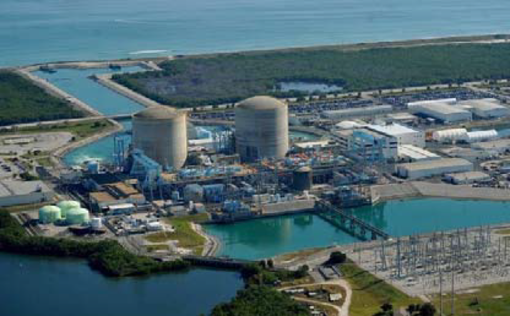
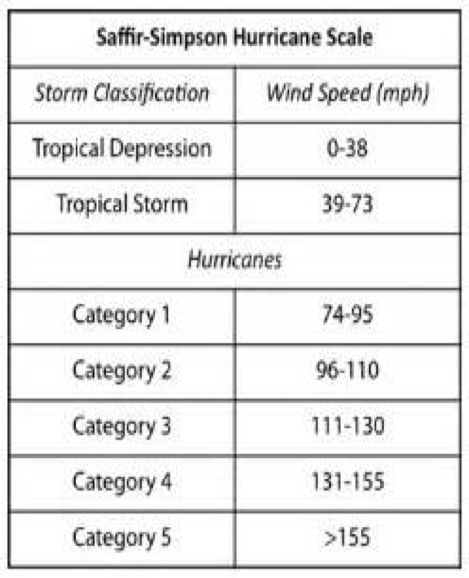
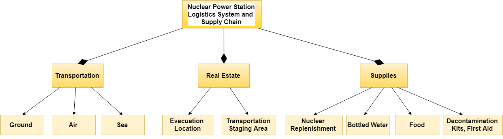
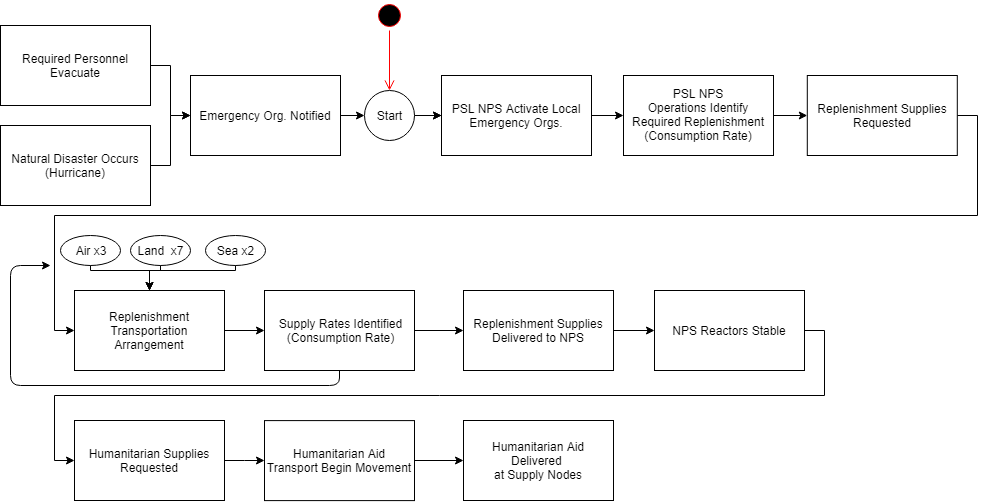
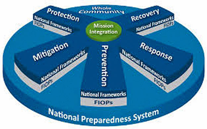

# IDS6145(SimTech 2018) - Research Plan

> * Group Name: Denominators
> * Group participants names: Jared Clark, Kamryx Davis & Jacob "TJ" Naylor
> * Project Title: Model Emergency Replenishment Supply Chain to the Port Saint Lucie, Florida Nuclear Power Station

## Abstract:

Natural disasters such as earthquakes, tsunami’s and hurricanes cause extensive damage to the affected areas and require substantial resources to rebuild the communities. Emergency managers at all levels must diligently allocate resources and supply replenishments. It is a process that involves a great deal of planning and preparation prior to an incident (NRC, 2017, pg. 1). In 2011, Port Saint Lucie nuclear power plant had 1,271,947 people living within 50 miles. The large population near the Port Saint Lucie nuclear power station, requires significant logistics resources to replenish the power plant and the local community following a natural disaster. This study uses Anylogic to model the emergency replenishment supply chain to the Port Saint Lucie, FL Nuclear Power Station after a natural disaster damages both primary and auxiliary power. The resupplying of the nuclear plant provides vital supplies to the plant to prevent a nuclear reactor accident as well as humanitarian aid to the local community. This study supports disaster relief efforts to a local community and provides solutions to emergency response leaders on how to logistically provide aid to the area in the event of a natural disaster and a possible reactor accident.

## General Introduction

Natural disasters cause significant damage and require substantial resources to support the affected area. Allocating emergency resources is a critical requirement for emergency managers at all levels and requires a great deal of planning and preparation prior to an incident (NRC, 2017, pg. 1). More recently, the hurricane damage in 2017 to Key West, Florida and Puerto Rico are prime examples of how difficult and extensive hurricane damage can be.  Additionally, the Haiti earthquake in 2010 is another example of severe consequences of a natural disaster, however, the relief efforts for those examples would have been exacerbated if the incident affected a nuclear facility. Considering disasters such as Fukushima Daiichi, it is imperative that nuclear facilities practice procedures to handle natural disasters and mitigate further damage to the affected area. Locally, the Port Saint Lucie, Florida Nuclear Power Station requires significant support should a natural disaster affect the area. In 2011, MSNBC using 2010 Census data conducted a study on populations within 5,10, 20 and 50 miles of nuclear power plants in the United States (Dedman, 2011). The Port Saint Lucie power plant was one of the sixty-five locations studied out of the 104 commercial nuclear power reactors in the United States. The population within 10 miles of Port Saint Lucie was 206,595 and 1,271,947 within 50 miles. The population increase from the 2000 Census was 49.7 percent and 37 percent respectively (Dedman, 2011). Given the large population within 50 miles of the Port Saint Lucie nuclear power station, logistics support to the power plant and the local community following a natural disaster is critical.

Currently, the Nuclear Regulatory Commission (NRC) along with federal and local agencies conduct biennial training for emergency preparedness of nuclear facilities across the United States (NRC, 2017, pg. 1). The emergency preparedness training primarily focuses on the response to and mitigation of radiation exposure to the public. Given the scope of the NRCs training with the nuclear facilities, there is little emphasis on logistics planning outside of the immediate containment and mitigation of nuclear radiation which leaves a preparedness gap for humanitarian support to the local community. This study uses Anylogic to model the emergency replenishment supply chain to the Port Saint Lucie, FL Nuclear Power Station after a natural disaster damages both primary and auxiliary power to prevent a nuclear reactor accident similar to Fukushima Daiichi. The purpose of this research is to determine how to replenish the nuclear power station and supply the local populace in a degraded environment after a major hurricane. Due to the significant damage from the hurricane, we hypothesize that the nuclear power station will require limited replenishment, approximately 176,515 personnel will remain in the Port Saint Lucie area and require logistics support and that aerial and ground transportation is the most successful transportation combination to replenish the nuclear power station and supply the local populace. Refinement of emergency response plans will save lives due to decreased response times and also reduce risk to critical infrastructure. This project makes the following contributions:

1. Provides logistics solutions to replenish the Port Saint Lucie nuclear power station.

2. Provides logistics solutions to support disaster relief efforts to the Port Saint Lucie community.

3. Offers M&S solutions to improve emergency response planning. 

## The Model

The logistics support to the Port Saint Lucie nuclear power station following a natural disaster is substantial and complex. Given the severity of the situation, supplies may be delivered by land, air, or sea. The structural and behavioral diagrams included below capture the most relevant logistic aspects required during an emergency event to the Port Saint Lucie nuclear power plant and community. The model simulates the logistics flow to the Port Saint Lucie nuclear power plant and community. Specific airframes, ground transportation vehicles and vessels are identified in the model to give a realistic depiction of the supply chain.

# Object Diagram

# Behavioral Diagram

# Anylogic Model

The program AnyLogic was used to create a model of disaster relief distribution in the Port St Lucie area after a hurricane has powered through the area. The model consists of several elements including agents/populations, state diagrams, process flow blocks, parameters, graphs and statistics. This model serves as a great framework to build upon in future. The discription of the Anylogic model is located in a word document [here](other/Model_Framework.docx). Additionally, two videos ([video 1](https://na01.safelinks.protection.outlook.com/?url=https%3A%2F%2Fyoutu.be%2F4mpysegv28c&data=02%7C01%7CTj.naylor%40knights.ucf.edu%7C40a2eb8b0a704a7cdeba08d5ae22d718%7C5b16e18278b3412c919668342689eeb7%7C0%7C0%7C636606387832244713&sdata=rk8hi4oubodT%2BfNTvrOgHg5uIkuUPGNPxG2C2AIEmSA%3D&reserved=0) and [video 2](https://na01.safelinks.protection.outlook.com/?url=https%3A%2F%2Fyoutu.be%2FLgQwYuQrvjo&data=02%7C01%7CTj.naylor%40knights.ucf.edu%7C40a2eb8b0a704a7cdeba08d5ae22d718%7C5b16e18278b3412c919668342689eeb7%7C0%7C0%7C636606387832244713&sdata=Z2sPt8M2nvkHggRcfAhkLQZpVbgycFaw%2F2RfU8KxSUg%3D&reserved=0)) are provided that describe setup and execution of the Anylogic model and statistics collection.

## Fundamental Questions

1. How can we safely replenish the nuclear power station?

2. How do we provide humanitarian aid to the local populace?

3. What are the resources required to accomplish the above questions?

4.  Based on the disaster and conditions, which mode of transportation (ground,air, and/or sea) would be the most efficient mode to deliver supplies and aid?

## Literature Review

Davis and Proctor (2016) discussed the concern for a nuclear plant Spent Fuel Pool (SFP) cooling and water replenishment during emergencies and natural disasters. They compared worst-case water loss rates to the published water throughput volumes several alternative water replenishment response methods useful in hypothetical disaster, response and mitigation scenarios. As discussed, this research focused on replenishing the water for the power station and therefore did not discuss the supply chain required to replenish the power station as a whole or the surrounding community. It helped inform our disaster relief concerns as they pertain to the quantity of water required for replenishment of the Port Saint Lucie Nuclear power station SPF. 
 
Dedman (2011) discussed the growing population in and around nuclear power plant locations across the country. He identified 65 locations of the 104-nuclear power plants across the U.S where the most population growth occurred. Of those, Port Saint Lucie was identified as one of the areas with a large population influx topping over one million people within a 50-mile radius of the power station. Dedman’s research documented the large population in and around the Port Saint Lucie power station but it does not address how those people would be support logistically during an emergency response incident. His research on population growth of the Port Saint Lucie area helped inform our population and logistics estimates for disaster response operations.
 
Sweeney (2017) discussed the probability of Floridians evacuating the area when the governor gives an evacuation order to residents. He identified that approximately 42% of Floridians will likely remain with the home and pets during a natural disaster. His research on the evacuation tendencies of Floridians during a natural disaster helped inform our population estimates and logistics requirements for Port Saint Lucie area during a disaster response.

## Expected Results
Due to the complex nature of emergency management operations the answer to the problem will be multifaceted and dynamic as conditions change. We predict that the most efficient mode to transport relief materials will be a combination of air and sea based assets until road conditions can be cleared. We also predict that stationing critical nodes for supplies will be crucial to providing assistance to both the NPS and surrounding area. The nodes will be dedicated to either providing NPS replenishment or humanitarian aid because of their unique needs. We predict that 42% of the population will remain in the local area however, the number of resources required will be dependent on the severity of the conditions.

## Research Methods
We will be using AnyLogic. A mixture of discrete event based simulation and agent based simulation. Discrete event based simulation will be used because the supply replenishment is triggered by the natural disaster to the power plant. Agent based simulation will be used because based on the conditions agents will distribute and replenish the supplies to agents at the nuclear plant and agents in the civilian population. We will be using imported data from various sources.

This research uses the Federal Emergency Management Agency (FEMA) National Response Framework, focusing on response, (figure 1) as well as a FEMA  inspired  			 [**Scenario**](./proposal/HurricaneScenariov2.docx) to address the disaster response situation. This research does not require the use of human subjects; however, a scenario was developed to scope response efforts and guide our simulation research. As stated previously, Anylogic will be used to simulate the supply chain for replenishment and disaster relief efforts. Three simulation iterations will be executed to help identify the most effective combination of transportation (land, sea, air) methods to provide support to the distressed populace and nuclear power station. The supply chain will be limited to no more than three locations on a given supply route and travel no further than 60 miles and all vehicles will undergo routine maintenance during the time of use. Timestamps of each transportation combination will be taken to distinguish the most successful resupply operations. Lastly,  we will use GIS and SPF consumption  datasets to plan disaster repsonse operations for the Port Saint Lucie nuclear power station.

Figure 1: Mission Integration within the National Preparedness System (FEMA 2015)

Downloaded from americansecuritytoday.com on 2/22/2018 at 10:00 am by tj.naylor@knights.ucf.edu.
## Discussion
(final only - remove whole section for proposal Readme) (What would you have done differently) (What are the contributions summerize)(what is the big take away)(what did you learn)

## Future Work
The current framework is the foundation we will use to enhance our research over the next six months and beyond. The research items are listed below.

1.	Improve the supply calculations to make the framework more robust for disaster relief operations. This includes adding usage or burn rates for supplies and the spent fuel pool. It also includes varying the amount of supplies burned at each supply node so the usage rate varies amongst  them and increases the demand and stress on the supply chain.

2.	Incorporate autonomous vehicles in the supply chain distribution for disaster relief to advance existing research. This includes autonomous delivery trucks as well as autonomous drones and helicopters. Using autonomous vehicles alleviates the need for crew rest and potentially increases the number of supply deliveries conducted within a 24-hour period.  Another consideration is to add vehicles with alternative fuel sources to support disaster relief operations. This also include addressing different behaviors that are relevant to vehicle usage such as durability, gas mileage, and terrain factors. Changing the vehicle fuel source should decrease fuel costs for both private and government organizations.

3.	Increase the hurricane category from 4 to a category 5. It will increase the amount of supplies and water needed for the spent fuel pool. Include alternate supply routes with and without obstacles to better portray road conditions following a hurricane. Though we accounted for the need to evacuate medical emergencies, the category 4 hurricane did not cause enough damage to require the local hospitals to transport medical emergencies to the Naval hospital ship located in vicinity of Boynton Beach. The category 5 hurricane will likely cause enough damage to stress local hospitals.

The research questions below are provided to expand upon some of the previously suggested research improvements.

1.	Based on the conditions of the category 5 hurricane, what combinations of transportation would be most efficient?
2.	How will the addition of autonomous vehicles and drones affect the delivery of supplies to the supply nodes and the Port St. Lucie surrounding area?

3.	What other ways can you model disaster relief in Anylogic or other modeling and simulation tools to improve disaster relief response?

## References

““Backgrounder on Emergency Preparedness at Nuclear Power Plants.” United States Nuclear Regulatory Commission - Protecting People and the Environment, U.S. NRC, 17 Feb. 2017, www.nrc.gov/reading-rm/doc-collections/fact-sheets/emerg-plan-prep-nuc-power.html.

 “Build A Kit.” Ready.gov, Department of Homeland Security, www.ready.gov/build-a-kit.
 
CNN Library. “Hurricane Statistics Fast Facts.” CNN, Cable News Network, 15 May 2017, www.cnn.com/2013/05/31/world/americas/hurricane-statistics-fast-facts/index.html.
Commonwealth of Massachusetts. 2013 State Hazard Mitigation Plan: Section 11. Hurricane and Tropical Storms, www.mass.gov/eopss/docs/mema/resources/plans/state-hazard-mitigation-plan/section-11-hurricane.pdf.

Dudenhoefer, Nicole. “As Hurricane Irma Approaches, Orlando Will Need Volunteers. Here's How You Can Help.” Orlando Weekly, Orlando Weekly, 14 Oct. 2017, www.orlandoweekly.com/Blogs/archives/2017/09/07/orlando-will-need-volunteers-for-shelters-heres-how-you-can-help.

“Florida Average Household Size, 2009-2013 by County.” Index Mundi, Index Mundi, www.indexmundi.com/facts/united-states/quick-facts/florida/average-household-size#map.

Grant, Kinsey. “Hurricane Irma: Two Nuclear Power Plants in Florida to Close Ahead of Storm.” TheStreet, TheStreet, 7 Sept. 2017, www.thestreet.com/story/14297649/1/hurricane-irma-two-nuclear-power-plants-in-florida-to-close-ahead-of-storm.html.

Germany, ZEIT ONLINE GmbH Hamburg. “How Many People Live near a Nuclear Power Plant in the USA?” ZEIT ONLINE, ZEIT ONLINE, opendata.zeit.de/nuclear-reactors-usa/#%2Fen%2Fflorida.

Hebdon, F.J. “Effect of Hurricane Andrew on the Turkey Point Nuclear Generating Station from August 20--30, 1992. [Final Report].” OTSI.GOV, U.S. Department of Energy Office of Scientific and Technical Information, 1 Mar. 1993, www.osti.gov/servlets/purl/10158520.

“Population within 10 and 50 Miles of Nuclear Power Plants.” NBCNews.com, NBCUniversal News Group, 13 Apr. 2011, www.nbcnews.com/id/42553681/ns/us_news/t/population-within-miles-nuclear-power-plants/#.Wol71WbMxTY.

UN Office for the Coordination of Humanitarian Affairs. “The Caribbean: Hurricane Irma Situation Report No. 04 (as of 10 of September 2017).” ReliefWeb, OCHA, 10 Sept. 2017, reliefweb.int/report/antigua-and-barbuda/caribbean-hurricane-irma-situation-report-no-04-10-september-2017.

Willingham, AJ. “A Look at Four Storms from One Brutal Hurricane Season.” CNN, Cable News Network, 21 Nov. 2017, www.cnn.com/2017/10/10/weather/hurricane-nate-maria-irma-harvey-impact-look-back-trnd/index.html.

