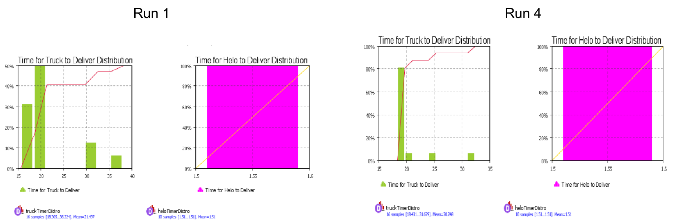
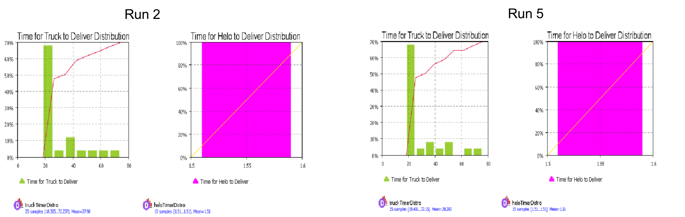
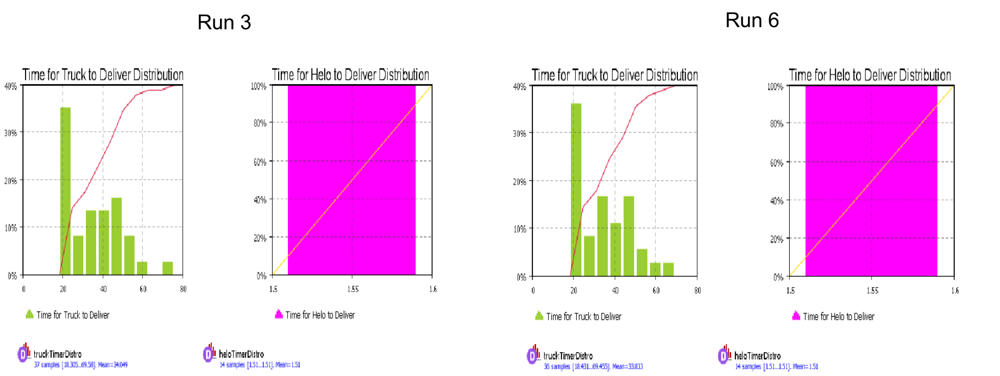
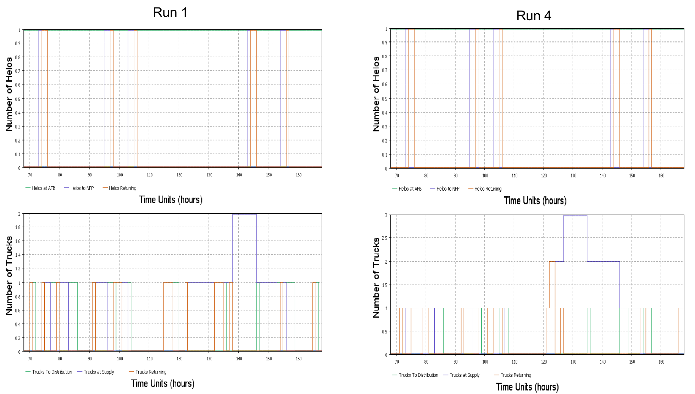
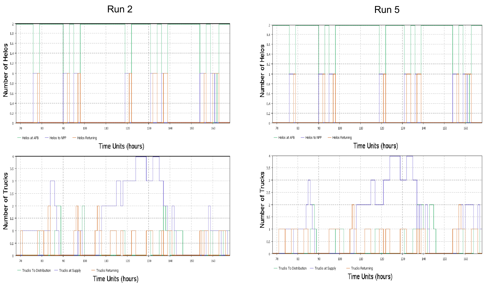
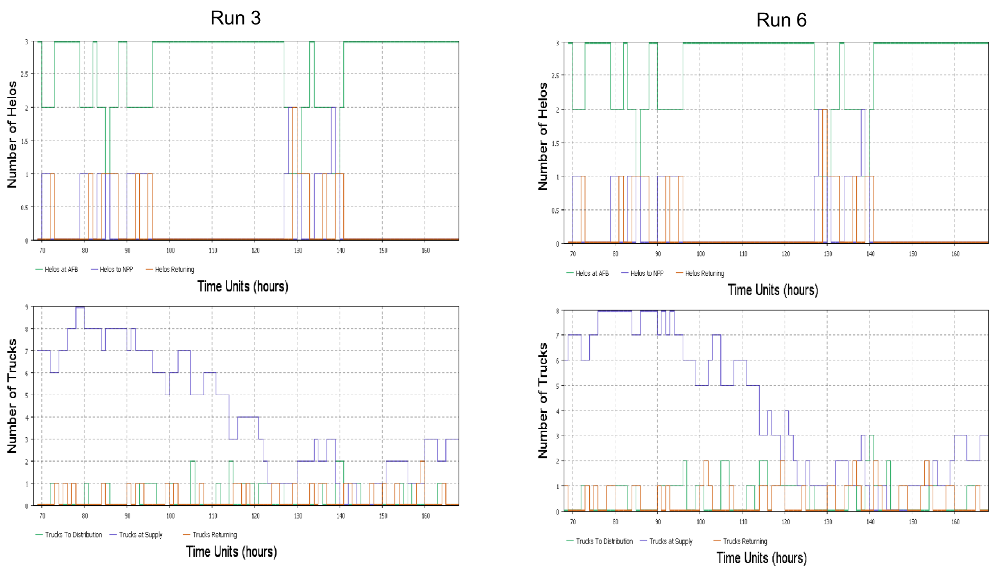
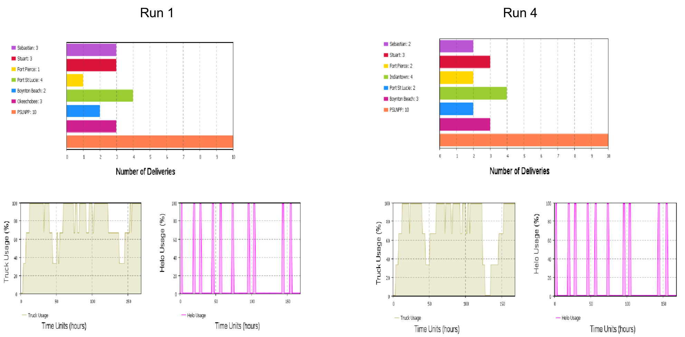
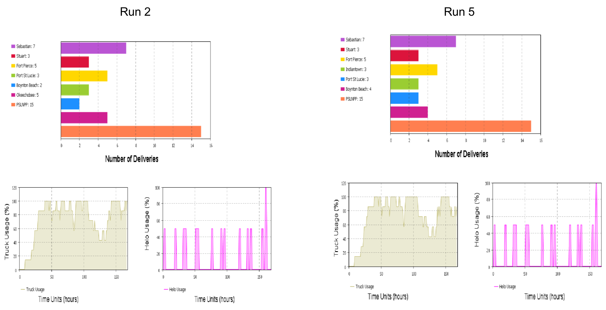
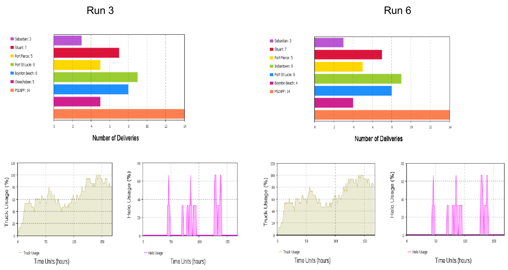

# IDS6145(SimTech 2018) - Research Plan

> * Group Name: Denominators
> * Group participants names: Jared Clark, Kamryx Davis & Jacob "TJ" Naylor
> * Project Title: Model Emergency Replenishment Supply Chain to the Port Saint Lucie, Florida Nuclear Power Station and Surrounding Areas

## Abstract:

Natural disasters such as earthquakes, tsunami’s and hurricanes cause extensive damage to the affected areas and require substantial resources to rebuild the communities. Emergency managers at all levels must diligently allocate resources and supply replenishments. It is a process that involves a great deal of planning and preparation prior to an incident (NRC, 2017, pg. 1). In 2011, Port Saint Lucie nuclear power plant had 1,271,947 people living within 50 miles. The large population near the Port Saint Lucie nuclear power station, requires significant logistics resources to replenish the power plant and the local community following a natural disaster. This study uses Anylogic to model the emergency replenishment supply chain to the Port Saint Lucie, FL Nuclear Power Station after a natural disaster damages both primary and auxiliary power. The resupplying of the nuclear plant provides vital supplies to the plant to prevent a nuclear reactor accident as well as humanitarian aid to the local community. This study supports disaster relief efforts to a local community and provides solutions to emergency response leaders on how to logistically provide aid to the area in the event of a natural disaster and a possible reactor accident.

## General Introduction

Natural disasters cause significant damage and require substantial resources to support the affected area. Allocating emergency resources is a critical requirement for emergency managers at all levels and requires a great deal of planning and preparation prior to an incident (NRC, 2017, pg. 1). More recently, the hurricane damage in 2017 to Key West, Florida and Puerto Rico are prime examples of how difficult and extensive hurricane damage can be.  Additionally, the Haiti earthquake in 2010 is another example of severe consequences of a natural disaster, however, the relief efforts for those examples would have been exacerbated if the incident affected a nuclear facility. Considering disasters such as Fukushima Daiichi, it is imperative that nuclear facilities practice procedures to handle natural disasters and mitigate further damage to the affected area. Locally, the Port Saint Lucie, Florida Nuclear Power Station requires significant support should a natural disaster affect the area. In 2011, MSNBC using 2010 Census data conducted a study on populations within 5,10, 20 and 50 miles of nuclear power plants in the United States (Dedman, 2011). The Port Saint Lucie power plant was one of the sixty-five locations studied out of the 104 commercial nuclear power reactors in the United States. The population within 10 miles of Port Saint Lucie was 206,595 and 1,271,947 within 50 miles. The population increase from the 2000 Census was 49.7 percent and 37 percent respectively (Dedman, 2011). Given the large population within 50 miles of the Port Saint Lucie nuclear power station, logistics support to the power plant and the local community following a natural disaster is critical.

Currently, the Nuclear Regulatory Commission (NRC) along with federal and local agencies conduct biennial training for emergency preparedness of nuclear facilities across the United States (NRC, 2017, pg. 1). The emergency preparedness training primarily focuses on the response to and mitigation of radiation exposure to the public. Given the scope of the NRCs training with the nuclear facilities, there is little emphasis on logistics planning outside of the immediate containment and mitigation of nuclear radiation which leaves a preparedness gap for humanitarian support to the local community. This study uses Anylogic to model the emergency replenishment supply chain to the Port Saint Lucie, FL Nuclear Power Station after a natural disaster damages both primary and auxiliary power to prevent a nuclear reactor accident similar to Fukushima Daiichi. The purpose of this research is to determine how to replenish the nuclear power station and supply the local populace in a degraded environment after a major hurricane. Due to the significant damage from the hurricane, we hypothesize that the nuclear power station will require limited replenishment, approximately 176,515 personnel will remain in the Port Saint Lucie area and require logistics support and that aerial and ground transportation is the most successful transportation combination to replenish the nuclear power station and supply the local populace. Refinement of emergency response plans will save lives due to decreased response times and also reduce risk to critical infrastructure. This project makes the following contributions:

1. Provides logistics solutions to replenish the Port Saint Lucie nuclear power station.

2. Provides logistics solutions to support disaster relief efforts to the Port Saint Lucie community.

3. Offers M&S solutions to improve emergency response planning.

## The Model

The logistics support to the Port Saint Lucie nuclear power station following a natural disaster is substantial and complex. Given the severity of the situation, supplies may be delivered by land, air, or sea. The structural and behavioral diagrams included below capture the most relevant logistic aspects required during an emergency event to the Port Saint Lucie nuclear power station and community. The model simulates the logistics flow to the Port Saint Lucie nuclear power station and community. Specific airframes, ground transportation vehicles and vessels are identified in the model to give a realistic depiction of the supply chain.

# Object Diagram

# Behavioral Diagram

# AnyLogic Model

The program AnyLogic was used to create a model of disaster relief supply distribution in the Port St Lucie, FL area after a hurricane. The model consists of several elements including agents/populations, state diagrams, process flow blocks, parameters, graphs and statistics. This model serves as a great framework to build upon in the future. The discription of the Anylogic model is located in a [**word document here**](other/Model_Framework.docx). Additionally, two videos ([**video 1**](https://na01.safelinks.protection.outlook.com/?url=https%3A%2F%2Fyoutu.be%2F4mpysegv28c&data=02%7C01%7CTj.naylor%40knights.ucf.edu%7C40a2eb8b0a704a7cdeba08d5ae22d718%7C5b16e18278b3412c919668342689eeb7%7C0%7C0%7C636606387832244713&sdata=rk8hi4oubodT%2BfNTvrOgHg5uIkuUPGNPxG2C2AIEmSA%3D&reserved=0) and [**video 2**](https://na01.safelinks.protection.outlook.com/?url=https%3A%2F%2Fyoutu.be%2FLgQwYuQrvjo&data=02%7C01%7CTj.naylor%40knights.ucf.edu%7C40a2eb8b0a704a7cdeba08d5ae22d718%7C5b16e18278b3412c919668342689eeb7%7C0%7C0%7C636606387832244713&sdata=Z2sPt8M2nvkHggRcfAhkLQZpVbgycFaw%2F2RfU8KxSUg%3D&reserved=0)) are provided that describe setup and execution of the Anylogic model and statistics collection. Ships were eventually dropped due to pathing issues when using GIS maps. Future works should incorporate these aganets for more robust simulation. Resources used to assist in the development of the model inculded [AnyLogic Help](https://help.anylogic.com/index.jsp) and [AnyLogic YouTube videos](https://www.youtube.com/user/anylogic).

## Fundamental Questions

1. How can we safely replenish the nuclear power station?

2. How do we provide humanitarian aid to the local populace?

3. What are the resources required to accomplish the above questions?

4.  Based on the disaster and conditions, which mode of transportation (ground, air, and/or sea) would be the most efficient mode to deliver supplies and aid?

5.  Develop a model and simualtion framework for future research into disaster relief for the area

## Literature Review

Davis and Proctor (2016) discussed the concern for a nuclear plant Spent Fuel Pool (SFP) cooling and water replenishment during emergencies and natural disasters. They compared worst-case water loss rates to the published water throughput volumes several alternative water replenishment response methods useful in hypothetical disaster, response and mitigation scenarios. As discussed, this research focused on replenishing the water for the power station and therefore did not discuss the supply chain required to replenish the power station as a whole or the surrounding community. It helped inform our disaster relief concerns as they pertain to the quantity of water required for replenishment of the Port Saint Lucie Nuclear power station SPF.

Dedman (2011) discussed the growing population in and around nuclear power plant locations across the country. He identified 65 locations of the 104-nuclear power plants across the U.S where the most population growth occurred. Of those, Port Saint Lucie was identified as one of the areas with a large population influx topping over one million people within a 50-mile radius of the power station. Dedman’s research documented the large population in and around the Port Saint Lucie power station but it does not address how those people would be support logistically during an emergency response incident. His research on population growth of the Port Saint Lucie area helped inform our population and logistics estimates for disaster response operations.

Sweeney (2017) discussed the probability of Floridians evacuating the area when the governor gives an evacuation order to residents. He identified that approximately 42% of Floridians will likely remain with the home and pets during a natural disaster. His research on the evacuation tendencies of Floridians during a natural disaster helped inform our population estimates and logistics requirements for Port Saint Lucie area during a disaster response.

## Assumptions

The following assumptions were made for this study:

1. All volunteered transportation equipment included operators and maintenance support.

2. Approximately 176,515 residents remain in the Port Saint Lucie area with minimal resources after the hurricane.

3. Only life threatening injuries are transported to the Navy Hosiptal located in vicinty of Boynton Beach, FL. This meant that resources already in the area were able to support the in-flux of persons. The Naval Hospital Ship was not required.

4. A category 4 hurricane requires at least one week of support beyond the local level to provide adeqate support and supplies to the local area.

5. Schools that are not severely damaged by the hurricane are approved at the state level to serve as distribution locations and shelter to support the local populace.

6. Bulk water for bathing and general use provided by the Hillsborough County Falkenburg Road Advanced Water Treatment Plant. As a result, this area was not focused on for this study.

7. Limited communications capability for the first week following the hurricane.

8. The Port Saint Lucie Power Station damage assessment clears the facility of damages but spent fuel pool level critically low.

## Research Methods
We used AnyLogic to conduct our experiment. This study included a mixture of discrete event based simulation and agent based simulation. Discrete event based simulation was used because the supply replenishment was triggered by the natural disaster to the power plant. Agent based simulation was  used because agents  distributed and replenished the supplies to agents at the nuclear plant and agents in the civilian population. We created data using the information from various sources.

This research used the Federal Emergency Management Agency (FEMA) National Response Framework, focusing on response, (figure 1) as well as a FEMA  inspired [**Scenario**](other/HurricaneScenariov3.docx) to address the disaster response situation. This research did not require the use of human subjects; however, a scenario was developed to scope response efforts and guide our simulation research. As stated previously, Anylogic was used to simulate the supply chain for replenishment and disaster relief efforts. Six simulation iterations were executed to help identify the most effective combination of transportation (land and air) methods to provide support to the distressed populace and nuclear power station. The supply chain delivered supplies to several locations along the supply routes using three different vehicle configurations. Timestamps of each transportation combination were taken to distinguish the most successful resupply operations. Lastly,  we used GIS and SFP consumption data to plan disaster repsonse operations for the Port Saint Lucie nuclear power station.

Figure 1: Mission Integration within the National Preparedness System (FEMA 2015)

Downloaded from americansecuritytoday.com on 2/22/2018 at 10:00 am by tj.naylor@knights.ucf.edu.

## Results

#### Time Distribution Graphs
* These runs were done with 3 trucks and 1 helicopter. Okeechobee’s run is displayed on the left and Indiantown’s run is displayed on the right. About 80% of the truck deliveries arrived within 20 hours of the request at Okeechobee. The same is true for Indiantown, about 80% of the truck deliveries arrived within 20 hours of the request. For both distribution sites, all deliveries for the helicopters were delivered within 1.5 hours. For each site, the vehicles took the same direct route and traveled the same distance.

* These runs were done with 7 trucks and 2 helicopters. Okeechobee’s run is displayed on the left and Indiantown’s run is displayed on the right. For both the distibution sites of Okeechobee and Indiantown, almost 70% of the trucks deliveries arrived within 20 hours of the request. For both sites, helicopters delivered within 1.5 hours of the request. For each site, the vehicles took the same direct route and traveled the same distance.

* These runs were done with 15 trucks and 3 helicopters. Okeechobee’s run is displayed on the left and Indiantown’s run is displayed on the right. For both sites, Okeechobee and Indiantown, 35% of trucks delivered supplies within 20 hours of the request. For both sites, the 3 helicopters delivered to the power station within 1.5 hours of the request. For each site, the vehicles traveled the same direct route and traveled the same distance.

#### Number of Agents within a Given State Graphs
* These graphs report what state the agents are in at any given time in the simulation for both trucks and helicopters. We can see where the agents are being utilized at. These graphs track the agents on their way to deliver, agents that are at the supply node, and the number of agents that are returning to the supply node. The more vehicles there are, the more they are staying in the supply hub because they are not needed. Okeechobee’s run is displayed on the left and Indiantown’s run is displayed on the right.

#### Usage Percentage and Deliveries Graphs
* These runs were done with 3 trucks and 1 helicopter. Indiantown’s run is displayed on the left while Okeechobee’s run is displayed on the right. The delivery rate for trucks was once a day per site. The delivery rate for helicopters was twice a day for the power station. No matter what site the trucks delivered to, the trucks had a 100% usage rate, more than half of the time. There was only 1 helicopter, so it had usage rates of 100% when it was being used, and 0% when it was not, which was expected. The helicopter was under utilized overall. When Indiantown was the distribution site, Port St. Lucie received the most deliveries, 4 over a 7-day span. When Okeechobee was the distribution site, Indiantown received the most deliveries, 4 over a 7-day span. No truck reached the 7 total deliveries requested from each site.  For both distribution sites, the helicopters delivered the 10 of the 14 needed deliveries to the Port Saint Lucie Nuclear Power Plant.  Both sites made a total of 26 deliveries.

* These runs were done with 7 trucks and 2 helicopters. Indiantown’s run is displayed on the left while Okeechobee’s run is displayed on the right. The delivery rate for trucks was once a day per site. The delivery rate for helicopters was twice a day for the power station. A 100% usage rate occurred for both locations for the trucks more than 50% of the time, but it’s less than the 3-truck usage rate. Both helicopters now maintain a usage rate of 50% expect towards the end of the run. There is lots of down time, when the helicopters are not doing anything for the site. The powerplant got all the requested deliveries. When Indiantown was the distribution site, only 1 site got all 7 requested deliveries which was Sebastian. Only 1 site got 2 requested deliveries which was Boynton Beach. When the distribution site was based out of Okeechobee, 3 sites got 3 of their requested orders and only 1 site which was also Sebastian received all 7 deliveries.  Both distribution sites made 25 deliveries just varying locations.

* These runs were done with 15 trucks and 3 helicopters. Indiantown’s run is displayed on the left while Okeechobee’s run is displayed on the right. The delivery rate for trucks was once a day per site. The delivery rate for helicopters was twice a day for the power station. The helicopters have under an 80% usage percentage and there was only a small amount of time the trucks’ usage rate was at 100% at both supply hubs. A majority of truck usage was under 80% of the time for both hubs. For the helicopters, the powerplant received all required 14 deliveries at both locations. For Indiantown as the distribution location, half the sites received the required 7 deliveries. The lowest delivery was 3 at Sebastian. For Okeechobee as the distribution location, half of the sites received the required 7 deliveries, the lowest was 3 also at Sebastian.

* Based on the results, the ideal number of helicopters needed to make deliveries is between 1 and 2. Also based on the results, the ideal number of trucks needed to make deliveries is somewhere between 7 and 15.

## Discussion
The results from the simulation runs infer several conclusions for the framework as built. The use of one helicopter was not enough to make the required two water deliveries a day for a week. Two helicopters were enough to accomplish this task. The addition of two helicopters also underutilizes the assets. This should open the asset to different disaster relief tasks.

Both three and seven trucks were not enough to deliver the required one delivery a day of supplies to the six distribution sites for a week. Fifteen trucks introduced considerable time that the trucks were not employed. Fifteen trucks were still unable to complete 7 deliveries to every distribution site. Three of the six sites received at least seven supply drops with some getting more than seven. This leads us to believe that the supply orders were somehow lost for some sites but registered for others. Further investigation into the requesting order AnyLogic block needs to be done to ensure orders are not dropped and are placed in a queue for later retrieval. Also, the introduction of more trucks increased the amount of time it took for deliveries to be received at the distribution sites. This phenomenon is believed to have occurred because the increased number of trucks overall reduced the distribution of delivery times. Even with these observations it appears that between seven to fifteen trucks could complete the required one delivery a day task.

The location of the supply hub, Indiantown or Okeechobee, did not have a noticeable effect on the time it took for deliveries to arrive at the distribution sites. This was probably because the distance between the two selected supply hubs are within half an hour of each other. For further development of the simulation framework one of two modifications could be made to the model. First, would be to increase the resolution of the time distribution results by changing the simulations step time from an hour to minutes. This should separate out the time to deliver distributions. The second option would be to select supply hubs with distances between them greater than an hour. Further investigation into supply hub placement needs to be done before specific recommendations can be made.

The Port St. Lucie Relief model provides a great framework for disaster relief supply chain modeling, but it is only a starting point. Building on the existing model and making it more robust is a future goal to achieve greater real-world mimicry. Some additional features or scenarios we would have liked to address:

* Vary vehicle supply loads (water, food, decontamination kits, hygienic goods all differing amounts)
* Implement vehicle supply node load limits and stress them
* Escalate the scenario to a Category 5 to test limitations of the civilian and military hospitals
* Create alternate supply routes and impede their travel
* Implement a sea aspect of response both supply chain and humanitarian/medical relief

The framework is a beginning step into modeling disaster relief in the Port St Lucie area. We tried to address were the best location was to set up a supply hub. Identifying the number of air and land assets required to accomplish delivery with a set quantity of supplies was also investigated. The number of helicopters required to replenish a nuclear reactor’s spent fuel pool was explored to see if the air assets could be used in different tasks and still maintain the appropriate water level in the pool. While these questions were specifically addressed, the largest contribution is providing a framework to build upon in future problem sets.

Modeling and simulating the complexities of a disaster response is difficult and nuanced. It requires examining fundamental questions of what is most important after a natural disaster. Once the basic attributes are identified then smaller variables can be implemented and examined. It is quickly apparent that significant coordination, communication, and planning prior to and after the incident is critical to a response effort. To accurately model the response of an area will require many iterations, the addition of complexity and more robust behavior models for the agents. The Port St Lucie Relief model and simulation is a good jumping off point but requires further development to provide emergency planners, state, local, and federal agencies, and humanitarian organizations with a reliable tool for decision making and planning.

## Future Work

The current framework is the foundation we will use to enhance our research over the next six months and beyond. The research items are listed below.

1.	Improve the supply calculations to make the framework more robust for disaster relief operations. This includes adding usage or burn rates for supplies and the spent fuel pool. It also includes varying the amount of supplies burned at each supply node so the usage rate varies amongst  them and increases the demand and stress on the supply chain. Lastly, increase the amounnt of civilian populace the require support in the Port Saint Lucie and surrounding areas.

2.	Incorporate autonomous vehicles in the supply chain distribution for disaster relief to advance existing research. This includes autonomous delivery trucks as well as autonomous drones and helicopters. Using autonomous vehicles alleviates the need for crew rest and potentially increases the number of supply deliveries conducted within a 24-hour period.  Another consideration is to add vehicles with alternative fuel sources to support disaster relief operations. This also include addressing different behaviors that are relevant to vehicle usage such as durability, gas mileage, and terrain factors. Changing the vehicle fuel source should decrease fuel costs for both private and government organizations. Add the sea response into the disaster relief model.

3.	Increase the hurricane category from 4 to a category 5. It will increase the amount of supplies and water needed for the spent fuel pool. Include alternate supply routes with and without obstacles to better portray road conditions following a hurricane. Though we accounted for the need to evacuate medical emergencies, the category 4 hurricane did not cause enough damage to require the local hospitals to transport medical emergencies to the Naval hospital ship located in vicinity of Boynton Beach. The category 5 hurricane will likely cause enough damage to stress local hospitals.

The research questions below expand upon some of the previously suggested research improvements.

1.	Based on the conditions of the category 5 hurricane, what combinations of transportation would be most efficient?

2.	How will the addition of autonomous vehicles and drones affect the delivery of supplies to the supply nodes and the Port St. Lucie surrounding area?

3.	What other ways can you model disaster relief in Anylogic or other modeling and simulation tools to improve disaster relief response?

## References

“Backgrounder on Emergency Preparedness at Nuclear Power Plants.” United States Nuclear Regulatory Commission - Protecting People and the Environment, U.S. NRC, 17 Feb. 2017, www.nrc.gov/reading-rm/doc-collections/fact-sheets/emerg-plan-prep-nuc-power.html.

 “Build A Kit.” Ready.gov, Department of Homeland Security, www.ready.gov/build-a-kit.
 
CNN Library. “Hurricane Statistics Fast Facts.” CNN, Cable News Network, 15 May 2017, www.cnn.com/2013/05/31/world/americas/hurricane-statistics-fast-facts/index.html.
Commonwealth of Massachusetts. 2013 State Hazard Mitigation Plan: Section 11. Hurricane and Tropical Storms, www.mass.gov/eopss/docs/mema/resources/plans/state-hazard-mitigation-plan/section-11-hurricane.pdf.

Davis, Matthew T., and Micheal D. Proctor. “The Viability of Extraordinary Methods to Mitigate Compromised SFP Cooling.” International Nuclear Safety Journal, vol. 5, no. 2, 2016, pp. 16–25., nuclearsafety.info/international-nuclear-safety-journal/index.php/INSJ.

Dedman, Bill. “What Are the Odds? US Nuke Plants Ranked by Quake Risk.” NBCNews.com, NBCUniversal News Group, 17 Mar. 2011, www.nbcnews.com/id/42103936/ns/world_news-asia_pacific/t/what-are-odds-us-nuke-plants-ranked-quake-risk/.

“Disaster Scenario Exercise for Community Planning Critical Power Failure.” FEMA, Department of Homeland Security, Jan. 2011, www.fema.gov/pdf/privatesector/ps_ttx_power_failure_jan_11.pdf.

Dudenhoefer, Nicole. “As Hurricane Irma Approaches, Orlando Will Need Volunteers. Here's How You Can Help.” Orlando Weekly, Orlando Weekly, 14 Oct. 2017, www.orlandoweekly.com/Blogs/archives/2017/09/07/orlando-will-need-volunteers-for-shelters-heres-how-you-can-help.

“Emergency Planning Exercises.” FEMA Emergency Planning Exercises, Official Website of the Department of Homeland Security, 30 Apr. 2017, www.fema.gov/emergency-planning-exercises.

“Florida Average Household Size, 2009-2013 by County.” Index Mundi, Index Mundi, www.indexmundi.com/facts/united-states/quick-facts/florida/average-household-size#map.

Germany, ZEIT ONLINE GmbH Hamburg. “How Many People Live near a Nuclear Power Plant in the USA?” ZEIT ONLINE, ZEIT ONLINE, opendata.zeit.de/nuclear-reactors-usa/#%2Fen%2Fflorida.

Grant, Kinsey. “Hurricane Irma: Two Nuclear Power Plants in Florida to Close Ahead of Storm.” TheStreet, TheStreet, 7 Sept. 2017, www.thestreet.com/story/14297649/1/hurricane-irma-two-nuclear-power-plants-in-florida-to-close-ahead-of-storm.html.

Hebdon, F.J. “Effect of Hurricane Andrew on the Turkey Point Nuclear Generating Station from August 20--30, 1992. [Final Report].” OTSI.GOV, U.S. Department of Energy Office of Scientific and Technical Information, 1 Mar. 1993, www.osti.gov/servlets/purl/10158520.

“Population within 10 and 50 Miles of Nuclear Power Plants.” NBCNews.com, NBCUniversal News Group, 13 Apr. 2011, www.nbcnews.com/id/42553681/ns/us_news/t/population-within-miles-nuclear-power-plants/#.Wol71WbMxTY.

Sweeney, Dan. “Floridians Likely Won't Obey Evacuation Orders in the next Hurricane.” SunSentinel, SunSentinel, 26 Oct. 2017, www.sun-sentinel.com/news/florida/fl-reg-hurricane-evacuation-poll-20171025-story.html.

UN Office for the Coordination of Humanitarian Affairs. “The Caribbean: Hurricane Irma Situation Report No. 04 (as of 10 of September 2017).” ReliefWeb, OCHA, 10 Sept. 2017, reliefweb.int/report/antigua-and-barbuda/caribbean-hurricane-irma-situation-report-no-04-10-september-2017.

Willingham, AJ. “A Look at Four Storms from One Brutal Hurricane Season.” CNN, Cable News Network, 21 Nov. 2017, www.cnn.com/2017/10/10/weather/hurricane-nate-maria-irma-harvey-impact-look-back-trnd/index.html.

